# KBot

KBot is a simple Telegram bot written in Go as part of a DevOps course.

The project uses:

- Go
- Cobra CLI
- Telebot
- Telegram Bot API
- environment variables for secure token configuration

## Telegram Bot

https://t.me/szdobnikova_bot

## Features

- Runs as a command-line application
- Connects to Telegram using the `TELE_TOKEN` environment variable
- Supports the `kbot` command and `start` alias
- Displays the application version
- Responds to the `/start hello` Telegram command

## Requirements

Before installation, make sure you have:

- Git
- Go installed
- Telegram bot token created via BotFather

Check the installed Go version:

```bash
go version
```

## Installation

Clone the repository:

```bash
git clone https://github.com/szdobnikova-code/kbot.git
cd kbot
```

Download project dependencies:

```bash
go mod download
```

## Telegram token configuration

Set the Telegram bot token using the terminal:

```bash
read -s TELE_TOKEN
```

After running the command:

1. Paste the Telegram bot token.
2. Press Enter.
3. The token will not be displayed because the `-s` option enables silent input.

Export the variable so that it is available to the application:

```bash
export TELE_TOKEN
```

You can verify that the variable exists without displaying the token:

```bash
test -n "$TELE_TOKEN" && echo "TELE_TOKEN is set"
```

Expected output:

```text
TELE_TOKEN is set
```

## Build

Build the application:

```bash
go build -o kbot
```

Run the application:

```bash
./kbot start
```

The `kbot` command can also be used:

```bash
./kbot kbot
```

Expected terminal output:

```text
kbot Version started
```

## Build with application version

The application version can be specified during the build using `ldflags`:

```bash
go build \
  -ldflags "-X github.com/szdobnikova-code/kbot/cmd.appVersion=v1.0.0" \
  -o kbot
```

Run the bot:

```bash
./kbot start
```

Expected terminal output:

```text
kbot v1.0.0 started
```

## Usage

Open the Telegram bot:

https://t.me/szdobnikova_bot

Send the following command:

```text
/start hello
```

Expected response:

```text
Hello I'm Kbot v1.0.0
```

The response version depends on the value provided during the build.

## CLI commands

Display available commands:

```bash
./kbot --help
```

Start the Telegram bot:

```bash
./kbot start
```

or:

```bash
./kbot kbot
```

Display the application version:

```bash
./kbot version
```

Example output:

```text
v1.0.0
```

## Project structure

```text
.
├── cmd
│   ├── kbot.go
│   ├── root.go
│   └── version.go
├── go.mod
├── go.sum
├── main.go
└── README.md
```

## CI/CD Workflow

The project uses GitHub Actions for continuous integration and delivery.

```mermaid
flowchart LR
    A[Push to develop] --> B[GitHub Actions]
    B --> C[Run Tests]
    C --> D[Build Docker Image]
    D --> E[Build linux/amd64]
    E --> F[Push Image to GHCR]
    F --> G[Update Helm Image Tag]
    G --> H[Commit to develop]
    H --> I[ArgoCD Auto Sync]
    I --> J[Kubernetes]
    J --> K[Telegram Bot]
```



The production image is built for `linux/amd64` as required.

ArgoCD monitors the `develop` branch and automatically synchronizes changes
from the Helm chart with the Kubernetes cluster.
